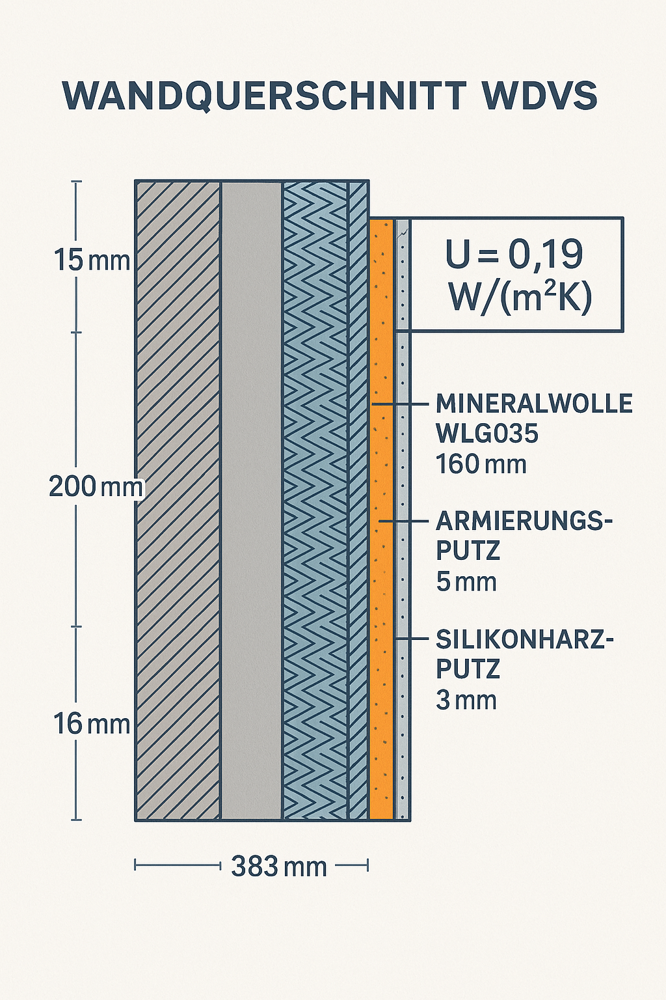

# Writing Guide — BIM Buch

Dieses Dokument beschreibt den verbindlichen Prozess für das Schreiben von Buchkapiteln.
Jeder schreibende Agent muss es vollständig lesen, bevor er ein Kapitel erstellt oder bearbeitet.

---

## Grundprinzipien

### 1. Jedes Kapitel beantwortet genau eine Frage

Bevor ein Wort geschrieben wird, muss klar sein: *Welche eine Frage beantwortet dieses Kapitel?*
Alles, was nicht zur Antwort beiträgt, gehört nicht ins Kapitel.

Beispiel:
- Kapitel 1 beantwortet: „Was ist ein Gebäude, wenn man es als System denkt?"
- Kapitel 6 beantwortet: „Wie verliert ein Gebäude Wärme, und wie hält man sie?"

### 2. Begriffe werden eingeführt, wenn der Leser sie braucht — nicht früher

Der U-Wert gehört in Kapitel 6 (Wärmeschutz), nicht in Kapitel 1 (Systemüberblick).
Der Eurocode gehört in Kapitel 4 (Tragwerk), nicht früher.

**Regel:** Ein Fachbegriff wird genau dort eingeführt, wo der Leser ihn braucht, um den nächsten
Satz zu verstehen. Nicht als Vorgriff, nicht als Vollständigkeitsübung.

Vor dem Schreiben: `docs/terms-registry.yaml` lesen, um zu wissen, welche Begriffe bereits
eingeführt sind und welche noch nicht. Nach dem Schreiben: Registry aktualisieren.

### 3. Das Leitbeispiel ist immer visuell getrennt vom Fließtext

Die Kastanienallee 7 darf **nie frei im Fließtext schwimmen**. Jede Anwendung des abstrakten
Prinzips auf das Leitbeispiel gehört in den `kastanienallee`-Container (siehe unten).
Der Leser muss immer wissen: „Bin ich gerade beim allgemeinen Prinzip oder beim konkreten Beispiel?"

### 4. Einstieg ist nie eine Definition

Jedes Kapitel beginnt mit 2–3 Sätzen, die eine greifbare Situation, Beobachtung oder
Frage beschreiben. Keine Definitionen, keine Normnummern, keine Klammerbegriffe.
Der Leser muss neugierig werden — dann erklären wir.

---

## Das Leitbeispiel: Kastanienallee 7

Alle Kapitel verwenden **dasselbe fiktive Referenzgebäude** als durchgehendes Beispiel:

> **Kastanienallee 7** — Mehrfamilienhaus, Bayern, Baujahr 2025 (fiktiv)
> 4 Vollgeschosse + Keller + DG · 12 Wohneinheiten · ~1.800 m² BGF
> Stahlbeton-Skelett mit Ziegelausfachung · Flachdach extensiv begrünt + PV 30 kWp
> Primärenergiebedarf: 45 kWh/(m²a) nach GEG

Die vollständigen Kenndaten findest du in `docs/appendix/kastanienallee7.md`.

---

## Kapitelstruktur (verbindliches Template)

```markdown
# Kapitel N – Titel

*Teil X – Teilname*

---

[Einstieg: 2–3 Sätze. Greifbare Situation, Beobachtung oder Frage.
 KEINE Definitionen, KEINE Normen, KEINE Fachkürzel.
 Der Leser muss neugierig werden.]

---

!!! ziel "Nach diesem Kapitel können Sie …"
    - [konkretes, messbares Lernziel]
    - [konkretes, messbares Lernziel]
    - [konkretes, messbares Lernziel]

## N.1 Abschnitt — Allgemeines Prinzip

[Fließtext: Konzept erklären, vom Allgemeinen zum Konkreten]

!!! kastanienallee "Kastanienallee 7"
    [Wie dieses Prinzip am Leitbeispiel-Gebäude konkret aussieht.
     IMMER in diesem Container. NIEMALS frei im Fließtext.]

## N.2 Weiteres Prinzip

[…]

## Zusammenfassung

**[Merksatz: Ein Satz, der den Kern des Kapitels trägt.]**

Verwandte Kapitel: [Kap. X](/chapters/…) · [Kap. Y](/chapters/…)
```

---

## Visuelle Container

### `!!! kastanienallee "Kastanienallee 7"`

**Zweck:** Jede Anwendung des abstrakten Prinzips auf das Leitbeispiel-Gebäude.

Regeln:
- Immer mit dem Titel „Kastanienallee 7"
- Enthält konkrete Zahlen, Abmessungen, Typen aus dem Leitbeispiel
- Steht nach dem Abschnitt, der das allgemeine Prinzip erklärt
- Pro Abschnitt maximal ein Kastanienallee-Container

```markdown
!!! kastanienallee "Kastanienallee 7"
    Die Außenwand besteht aus 200 mm Stahlbeton plus 160 mm Mineralwolle (WLG 035).
    Das ergibt einen Wärmedurchgangswiderstand von R = 0,16 / 0,035 = 4,57 m²K/W.
```

### `!!! ziel "Nach diesem Kapitel können Sie …"`

**Zweck:** Lernziele des Kapitels, genau einmal direkt nach dem Einstieg.

```markdown
!!! ziel "Nach diesem Kapitel können Sie …"
    - den U-Wert eines mehrschichtigen Bauteils berechnen
    - die GEG-Anforderung für Außenwände einordnen
    - das Prinzip des Wärmedämmverbundsystems erklären
```

### `!!! note "Hinweis"`

**Zweck:** Erläuternder Einschub oder Begriffsklärung, die den Lesefluss unterbrechen würde.

### `!!! tip "Praxistipp"`

**Zweck:** Hinweis aus der Planungspraxis, der nicht aus einer Norm stammt.

### `!!! warning "Achtung"`

**Zweck:** Bekanntes Fehlerquellenmuster oder häufiger Planungsfehler.

---

## Glossarbegriffe und Terminologie

### Glossar-Datei

Alle Fachbegriffe mit ihren Definitionen sind in `web/src/data/glossar.ts` gespeichert.
Lies diese Datei, um die verfügbaren IDs, Abkürzungen und Definitionen zu kennen.

### Terms Registry

Die Datei `docs/terms-registry.yaml` protokolliert, in welchem Kapitel jeder Begriff
**zum ersten Mal** eingeführt wurde.

**VOR dem Schreiben eines Kapitels:**
1. Lies `docs/terms-registry.yaml`
2. Begriffe mit `introduced_in` gesetzt UND Kapitel-ID vor deinem Kapitel → frei mit `::ABBREV::` verwenden
3. Begriffe mit `introduced_in: null` → erst einführen, wenn der Leser sie braucht

**NACH dem Schreiben:**
Trage jeden neu eingeführten Begriff in die Registry ein.

### Markup-Syntax

**Ersteinführung** (introduced_in ist null oder dieses Kapitel):
```markdown
Die **Technische Gebäudeausrüstung** (::TGA::) umfasst alle haustechnischen Systeme…
```
→ Vollständiger Name fett, Abkürzung in Klammern mit `::…::`.

**Folge-Verwendungen** (Begriff bereits eingeführt):
```markdown
Die ::TGA:: bestimmt die Schachtgrößen…
```
→ Nur `::…::`, kein Fettdruck.

**Begriff ohne Abkürzung** (z.B. Wärmebrücke):
- Ersteinführung: `**::Wärmebrücke::**`
- Folge-Verwendung: `::Wärmebrücke::`

**Wichtig:** Niemals `**fett**` als Ersatz für einen fehlenden Glossareintrag verwenden.
`**fett**` ist ausschließlich für:
- Labels in Listen (`**Tragstruktur:** Stahl, Stahlbeton…`)
- Leit- oder Merksätze am Ende von Abschnitten
- Nicht-terminologische Hervorhebungen

Wenn ein Fachbegriff fehlt:
1. Eintrag in `web/src/data/glossar.ts` anlegen
2. Dann `::Begriff::` im Markdown verwenden

### Häufige Term-IDs (Kurzreferenz)

| Schreibweise | Term-ID | Erste Einführung in |
|---|---|---|
| `::TGA::` | tga | Kap. 1 |
| `::Schichtenmodell::` | schichtenmodell | Kap. 1 |
| `::GEG::` | geg | Kap. 6 |
| `::U-Wert::` | u-wert | Kap. 6 |
| `::R-Wert::` | r-wert | Kap. 6 |
| `::WDVS::` | wdvs | Kap. 5 oder 6 |
| `::Mineralwolle::` | mineralwolle | Kap. 3 |
| `::WLG::` | wlg | Kap. 3 |
| `::Wärmebrücke::` | wärmebrücke | Kap. 6 |
| `::Eurocode::` | eurocode | Kap. 4 |
| `::GFZ::` | gfz | Kap. 2 |
| `::GRZ::` | grz | Kap. 2 |
| `::MBO::` | mbo | Kap. 2 |
| `::Glaser-Verfahren::` | glaser-verfahren | Kap. 7 |
| `::Dampfbremse::` | dampfbremse | Kap. 7 |
| `::Dampfsperre::` | dampfsperre | Kap. 7 |
| `::REI::` | rei | Kap. 9 |
| `::FBH::` | fbh | Kap. 10 |
| `::KWL::` | kwl | Kap. 11 |
| `::DVGW::` | dvgw | Kap. 12 |
| `::HOAI::` | hoai | Kap. 15 |
| `::VOB::` | vob | Kap. 16 |
| `::BIM::` | bim | Kap. 17 |
| `::IFC::` | ifc | Kap. 18 |
| `::LOD::` | lod | Kap. 18 |
| `::BCF::` | bcf | Kap. 20 |
| `::BAP::` | bap | Kap. 20 |
| `::EPD::` | epd | Kap. 22 |
| `::Embodied Carbon::` | embodied-carbon | Kap. 22 |

### Neuen Glossareintrag anlegen

Wenn ein Begriff fehlt, zuerst in `web/src/data/glossar.ts` eintragen:

```ts
{
  id: 'schichtenmodell',
  term: 'Schichtenmodell',
  definition: 'Kurze, präzise Definition …',
  thema: 'Konstruktion',
  typ: 'Begriff',
}
```

**Erlaubte `thema`-Werte:** `BIM` · `Wärmeschutz` · `Feuchteschutz` · `Schallschutz` · `Brandschutz` · `TGA` · `Baurecht` · `Konstruktion` · `Energie` · `Nachhaltigkeit`

**Erlaubte `typ`-Werte:** `Begriff` · `Kennwert` · `Verfahren` · `Material` · `Norm`

Einträge alphabetisch nach `id` sortiert halten.

---

## Formel-Hover: `^^formel-id^^`

Formeln werden im Text mit `^^formel-id^^` eingebettet:

```markdown
Der ::U-Wert:: berechnet sich als ^^u-wert^^, wobei alle Schichtwiderstände addiert werden.
```

Verfügbare Formel-IDs (aus `web/src/data/formulas.ts`):

| Formel-ID | Formel |
|---|---|
| `^^u-wert^^` | U-Wert nach DIN EN ISO 6946 |
| `^^r-wert^^` | R = d/λ |
| `^^transmissionswaermeverlust^^` | HT = Σ U·A·fx |
| `^^gfz^^` | Geschossflächenzahl GFZ |
| `^^grz^^` | Grundflächenzahl GRZ |
| `^^primaerenergiebedarf^^` | Qp = Qf · fp |
| `^^schalldaemmass^^` | R'w |
| `^^waermeleitung^^` | q = λ · ΔT/d |

---

## Bilder: Platzhalter mit Prompt

Jedes noch nicht vorhandene Bild wird als Platzhalter-Block gesetzt:

```markdown
<!-- IMAGE
name: kap06_wandaufbau_wdvs
type: section
size: landscape
desc: Wandquerschnitt WDVS mit 5 Schichten von innen nach außen: Innenputz 15 mm (glatt),
  Stahlbeton 200 mm (grau, Diagonalschraffur), Mineralwolle WLG 035 160 mm (blau, Zickzack),
  Armierungsputz 5 mm, Silikonharzputz 3 mm. Maßketten rechts in mm, Beschriftungen deutsch,
  weißer Hintergrund, technisch-clean, keine Personen.
caption: Wandaufbau mit WDVS — Kastanienallee 7
tags: wdvs, wärmeschutz, wandquerschnitt, kastanienallee7
-->

```

**Pflichtfelder:**

| Feld | Bedeutung |
|---|---|
| `name` | Dateiname ohne `.png` — Schema: `kapNN_stichwort` |
| `type` | `section` · `diagram` · `isometric` · `floorplan` · `comparison` · `infographic` |
| `size` | `landscape` (Standard) · `square` · `portrait` |
| `desc` | Vollständige Bildbeschreibung für die KI — so präzise wie möglich |
| `caption` | Bildunterschrift |
| `tags` | Kommagetrennte Stichwörter |

**Regeln:**
- `name` muss mit dem Dateinamen im `` übereinstimmen
- `desc` trägt alle fachlichen Details: Schichten, Maße, Schraffurmuster, Beschriftungssprache
- Bilder werden mit `python3 skills/imagegen/generate-placeholders.py` batch-generiert

---

## Querverweise und Links

Jeder Verweis auf ein anderes Kapitel muss ein echter Markdown-Link sein. Kein `→` vor Links.

```markdown
[Kap. 6](/chapters/06-waermeschutz-geg)
[IFC-Schnellreferenz](/appendix/ifc-referenz)
[Kastanienallee 7](/appendix/kastanienallee7)
[Glossar](/glossar)
[Formelsammlung](/formelsammlung)
```

**Pfadübersicht:**

| Ziel | Pfad |
|---|---|
| Kapitel N | `/chapters/NN-slug` |
| IFC-Schnellreferenz | `/appendix/ifc-referenz` |
| Kastanienallee 7 | `/appendix/kastanienallee7` |
| Normen & Gesetze | `/appendix/normen` |
| Glossar | `/glossar` |
| Formelsammlung | `/formelsammlung` |

---

## Stil und Sprache

- **Ton:** sachlich, direkt, kein Füllwerk. Wie ein erfahrener Praktiker erklärt.
- **Einstieg:** nie eine Definition, nie „In diesem Kapitel werden wir…"
- **Satzlänge:** mittellang. Keine Schachtelsätze.
- **Absatzgröße:** 3–5 Sätze. Ein Absatz, ein Gedanke.
- **Begriffe:** Nur einführen, wenn der Leser sie jetzt braucht.
- **Kastanienallee:** Immer im Container, niemals frei im Fließtext.
- **Keine Wiederholung:** Was früher erklärt wurde, wird referenziert, nicht wiederholt.

---

## Kapitel-Ablauf (Checkliste für den schreibenden Agent)

1. `docs/terms-registry.yaml` lesen → welche Begriffe sind bereits eingeführt?
2. `web/src/data/glossar.ts` lesen → welche Term-IDs stehen zur Verfügung?
3. `docs/appendix/kastanienallee7.md` lesen → aktuelle Kenndaten des Leitbeispiels
4. Die *eine Frage* des Kapitels formulieren — alles, was nicht zur Antwort beiträgt, weglassen
5. Kapitel schreiben nach obigem Template:
   - Einstieg ohne Definitionen
   - Lernziele im `ziel`-Container
   - Allgemeine Prinzipien im Fließtext
   - Leitbeispiel-Anwendungen im `kastanienallee`-Container
   - Bilder als Platzhalter-Blöcke
6. `docs/terms-registry.yaml` mit neu eingeführten Begriffen aktualisieren

## Bilder generieren (nach dem Schreiben)

```bash
# Alle fehlenden Bilder generieren:
python3 skills/imagegen/generate-placeholders.py

# Vorschau ohne Generierung:
python3 skills/imagegen/generate-placeholders.py --dry-run

# Nur ein bestimmtes Kapitel:
python3 skills/imagegen/generate-placeholders.py --chapter 06
```
